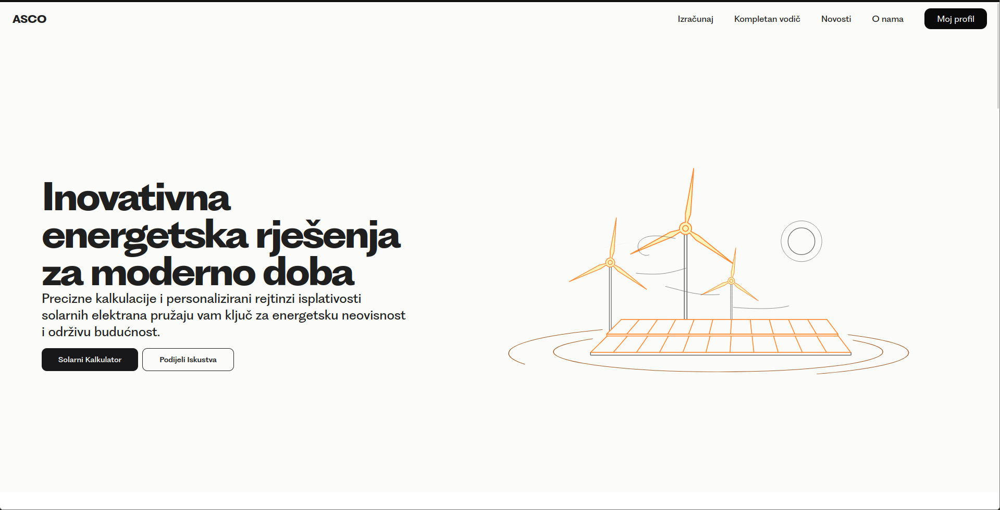
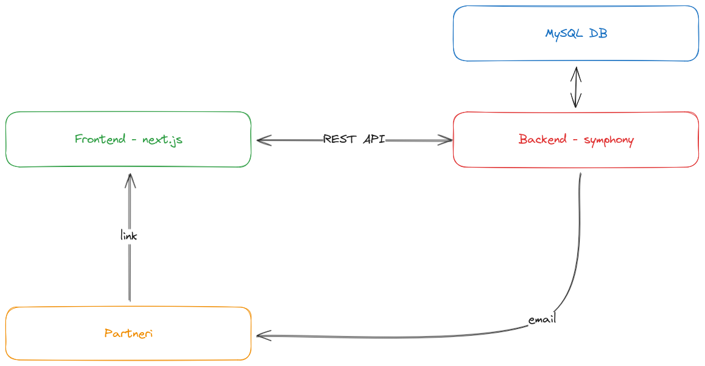
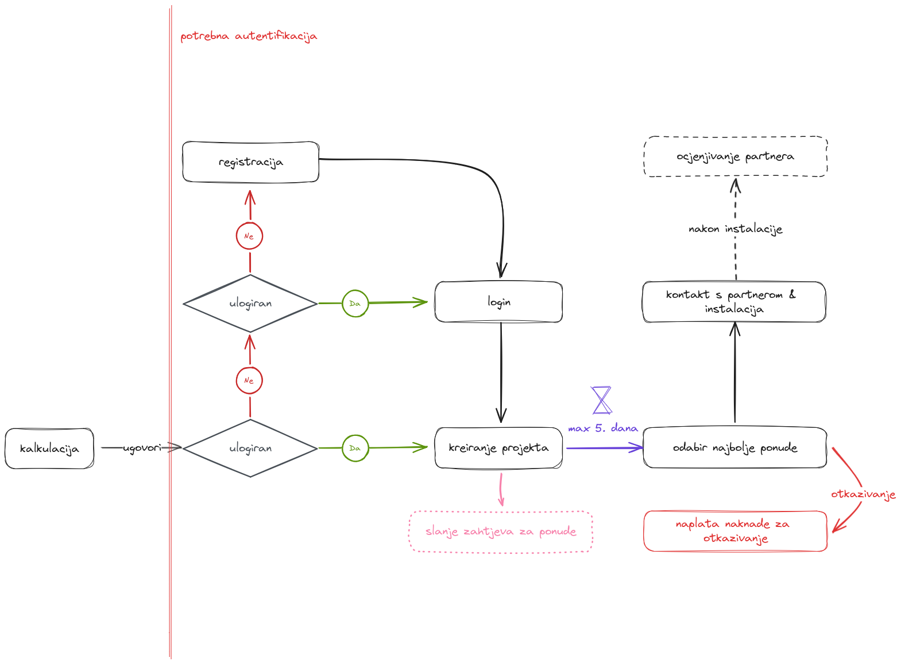
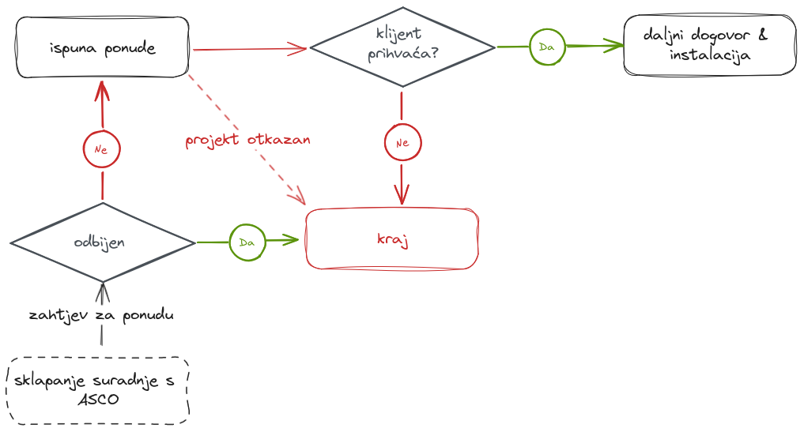

# ASCO

Glavni i jedini repozitorij za MC2 projekt ASCO.

## Arhitektura & Tehnologije

- [Frontend](./client/)
- [Backend](./server/)

### [Frontend](./client/)

> Upute, struktura te ostale informacije o frontendu se nalaze u [client/readme.md](./client/readme.md)

- Next.js
- React
- TailwindCSS - stilizacija
- Radix UI - komponente
- Zustand - globalno klijent stanje
- React Query - dohvat podataka
- React Hook Form - forme

### [Backend](./server/)

> Upute, struktura te ostale informacije o backendu se nalaze u [server/readme.md](./server/readme.md)

- Symfony
- MySQL

## User Flow

## Partner flow

